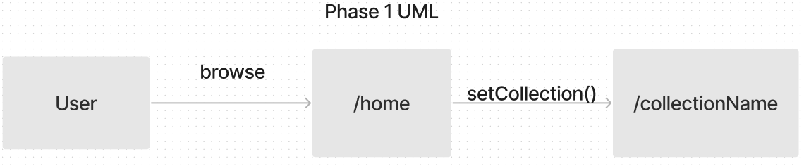

# Storefront

## Phase 2
- Allow user to add Items to a cart
- Allow user to see the items they have added to the cart
- Allow the User to change the quantity of items in a cart
- Allow user to remove item from the Cart

### Learning from the Phase
- Very similar to phase 1 with regards to approach
- Implemented a modal for the cart, which opens when the user clicks on the view cart button
- Modal displays a scrollable list of items that the user has added 
- Each item on the list in the cart allows the users to increment/decrement the items in the cart, with the item being removed when the quantity reaches zero. 

## Phase 1
- Display an available list of product categories
- Allow user to select a category and see list of all available products in that category
- implement material UI
- use redux store to mange state of categories and items in store.

### UML

### Wireframe

### Learning for this Phase

#### Redux Basics
Principals of Redux
1. Single source of trute, ie the state of the entire application is kept within a single store/state tree. 
2. State is read only, and the only way to change the state is to trigger an action. 
3. Changes are made with pure functions, ie those whose return values depend entirely on the values of their arguements. 
Redux has Four Components. 
1. An action is the only way to change state conent. It is an object which has the main source of information used to send data. To call actions, use the dispatch() method.
2. Actions describe that SOMETHING has happened, and reducers specify how the application state is to change in response. 
3. A store is an object which can hold the applications state and provide helper methods to access the state, dispatch actions, and register listeners. 
- [The Docs of getting Started](https://redux-toolkit.js.org/tutorials/quick-start) 
